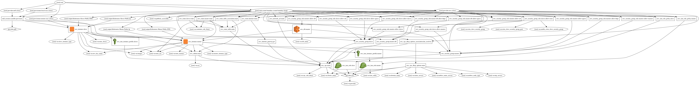

# terraform-kubernetes

A terraform module for provisioning AWS resources (VMs, VPC, route table etc) for running a Kubernetes cluster.  Builds a multi-master, multi-AZ cluster for Kubernetes.

### This is test for creating infrastructure for k8s

To use:

```shell
git clone --recursive https://github.com/pyToshka/terraform-cluster-kubernetes
cd terraform-kubernetes
Add your vars to variables.tf
Don't forget change this
variable "provider" {
    type = "map"
    default = {
        access_key = "your_access_key"
        secret_key = "your_secret_key"
        region     = "us-east-1"
    }
}
terraformt init 
terraform plan
terraform apply
```
### Howto deploy cluster?
```shell
git clone --recursive https://github.com/pyToshka/terraform-cluster-kubernetes
cd terraform-kubernetes
add your vars to variables.tf


```

For building stack run

```shell

./clister.sh

```

Terraform Graph


